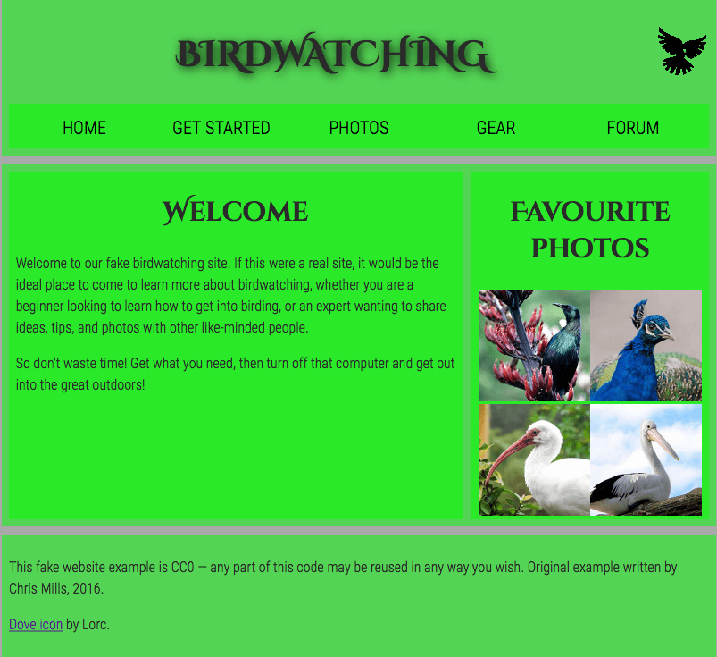

# Web Dev Starter Code

## Overview

This is a website that is made for the sole purpose of exercising CSS skills, whether it be refreshing or learning. Given a screenshot, the target of this website is to replicate that site.

## Please Note

This website has responsive styling. Scale your window down to the same ratio as the screenshot below (relatively small window size).

## Run

- Open the index.html file
- Run your html preferred server to view the html file.
- i.e. VSCode plugin, IntelliJ IDE, etc.

## Sources and Credits

- Horizontal Line Styling: <https://getbootstrap.com/>
